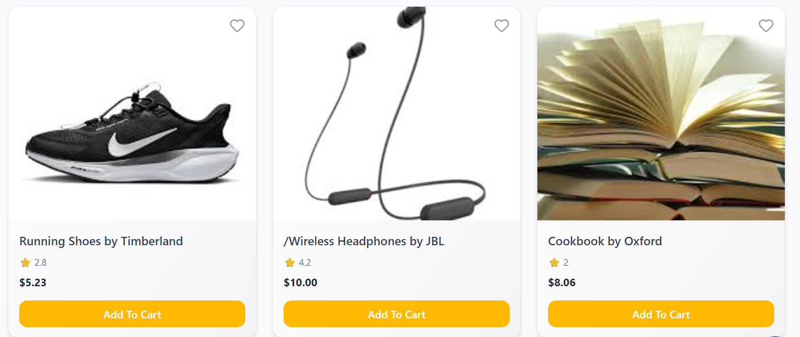
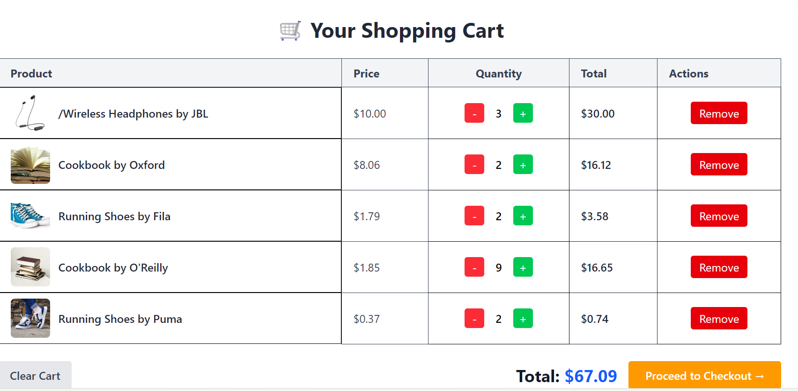
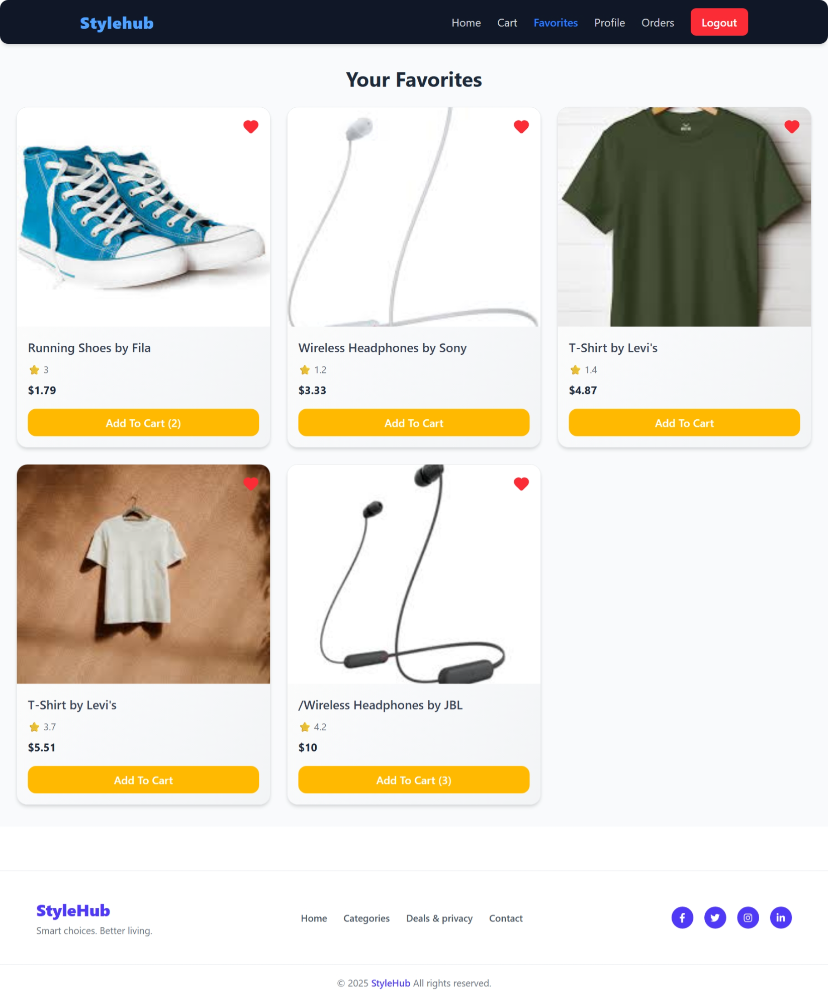
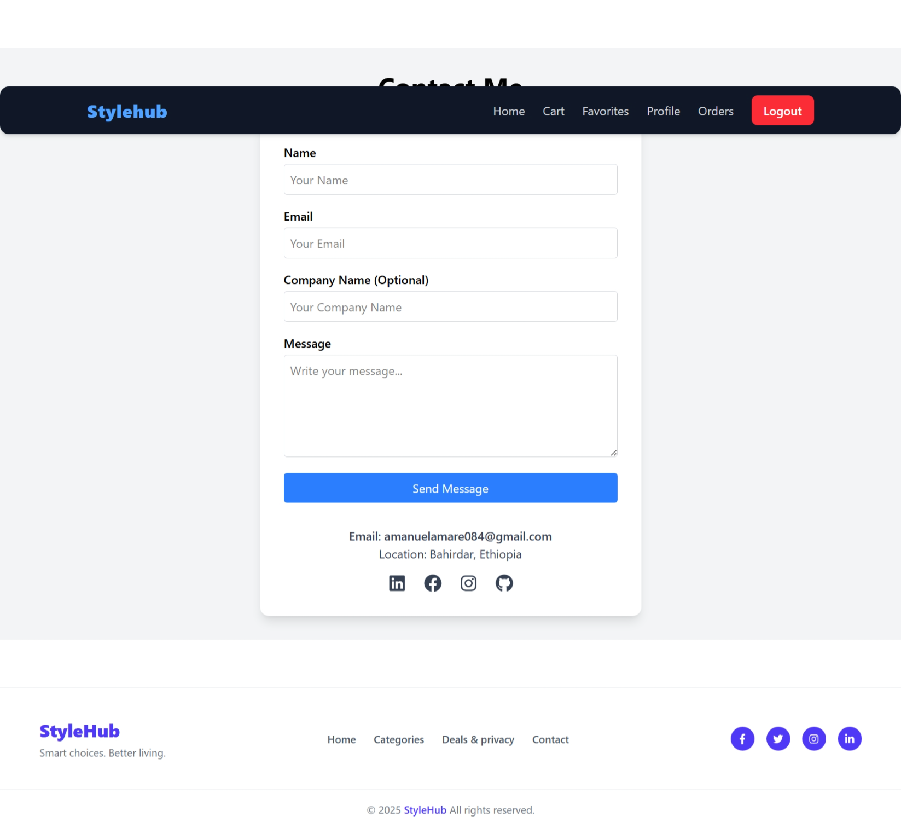
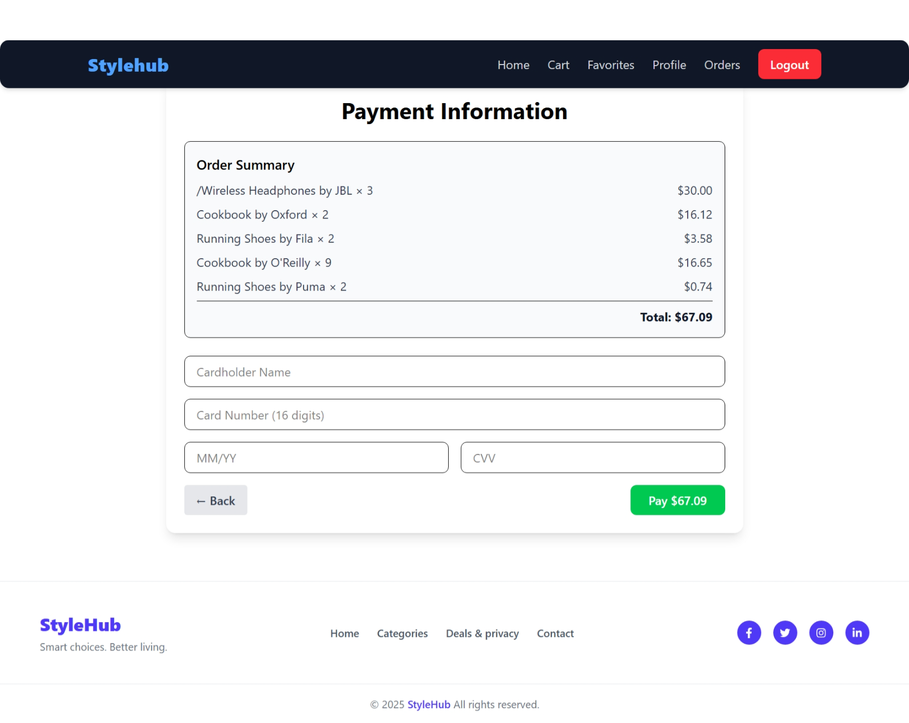

# 🛒 E-Commerce Website

[](LICENSE)  
[](https://react.dev/)  
[](https://tailwindcss.com/)  
[](https://vitejs.dev/)  
[](https://vitest.dev/)  
[](https://e-commerce-49ma.vercel.app/)

A **modern responsive e-commerce frontend** built with **React**, **Tailwind CSS**, and **Vite**.  
Features **product listing**, **cart management**, **favorites**, **dummy payment flow**, **EmailJS contact form**, **AI-driven UI**, and a **clean responsive design**.

---

## 🔗 Live Demo
👉 [View Demo](https://e-commerce-49ma.vercel.app/)

---

## 📸 Screenshots

| Home | Product | Cart |
|------|---------|------|
|  |  |  |

| Favorites | Contact | Payment |
|-----------|---------|---------|
|  |  |  |

---

## 🚀 Features

- 🛍️ Product Listing – Images, prices, descriptions  
- 🛒 Shopping Cart – Add/remove items, update quantities, localStorage persistent  
- ❤️ Favorites / Wishlist – Save favorite products  
- ✉️ Contact Form – EmailJS frontend integration  
- 💳 Payment (Demo) – Address + card form UI for checkout simulation  
- 🔍 Search & Filter – Keyword & category search  
- 🤖 AI Visibility Component – AI-driven product suggestions  
- 📦 Order History – Simulated order progress (Pending → Delivered)  
- 🧪 Testing – Vitest + Testing Library for UI & logic  

---

## 🛠 Tech Stack

- **Frontend:** React + Vite  
- **Styling:** Tailwind CSS  
- **State Management:** React Context API + Zustand + Hooks  
- **Email Service:** EmailJS  
- **Icons:** Lucide React  
- **Hosting:** Vercel  
- **Data:** Static JSON (mock backend)

---

## 💻 Installation & Setup

```bash
# 1. Clone repo
git clone https://github.com/amanuel1221/e-commerce.git
cd e-commerce

# 2. Install dependencies
npm install

# 3. Add environment variables (.env)
VITE_EMAILJS_SERVICE_ID=xxxx
VITE_EMAILJS_TEMPLATE_ID=xxxx
VITE_EMAILJS_PUBLIC_KEY=xxxx

# 4. Start dev server
npm run dev

# 5. Open app
http://localhost:5173
🧪 Testing
bash
Copy code
# Run all tests
npm run test
ProductCard Tests: Rendering, add to cart, favorites, filtering, load more

Cart Tests: Increment/decrement, remove, clear cart, total calculation

Orders Tests: Current user filtering, mark delivered, clear history

Testing Experience:

Initial failures due to undefined props and missing store mocks

Solved with mocking Zustand store/context and passing proper test data

Learned state, props, and hooks interactions in tests

After debugging, all tests pass successfully ✅

📂 Project Structure
css
Copy code
e-commerce/
├─ public/
├─ src/
│  ├─ components/
│  │   ├─ Header.jsx
│  │   ├─ Footer.jsx
│  │   ├─ ProductCard.jsx
│  │   ├─ CartItem.jsx
│  │   ├─ FavoriteItem.jsx
│  │   ├─ ContactForm.jsx
│  │   ├─ PaymentForm.jsx
│  │   └─ AIVisibility.jsx
│  ├─ pages/
│  │   ├─ Home.jsx
│  │   ├─ Product.jsx
│  │   ├─ Cart.jsx
│  │   ├─ Favorites.jsx
│  │   ├─ Contact.jsx
│  │   └─ Payment.jsx
│  ├─ context/
│  ├─ data/
│  ├─ services/
│  ├─ store/
│  ├─ App.jsx
│  └─ main.jsx
├─ package.json
├─ tailwind.config.js
├─ vite.config.js
└─ README.md
⚡ Usage
Browse products & add to Cart/Favorites

Manage items from Cart/Favorites

Submit Contact Form (EmailJS)

Test demo Payment UI

View AI suggested items

🧠 What I Learned
Component Architecture: Reusable components, props, shared state

EmailJS: Setup, environment variables, debugging failed submissions

UI Libraries: Tailwind, Lucide icons, Framer Motion

Cart & Payment Logic: State management, totals, multi-step checkout

Testing: Mocking context, handling hooks, UI & state validation

Deployment: Vercel build fixes & environment variables

🧩 Challenges & Solutions
Component connection issues → Fixed by lifting state & reorganizing components

EmailJS failures → Correct IDs & .env setup

UI bugs → Debugged imports & library setup

Cart/Payment bugs → Fixed totals & navigation

Testing failures → Mocked store & context properly, carefully passing data → all tests pass ✅

🔧 Future Improvements
Real backend (Node.js / Django)

Real payments (Stripe/PayPal)

Admin dashboard

AI-powered recommendations

Persistent orders & favorites in database

🤝 Contributing
bash
Copy code
# Fork the repo
git checkout -b feature/your-feature
git commit -m "Add feature"
git push origin feature/your-feature
Open a pull request 🚀

📄 License
This project is licensed under the MIT License.

🌟 Acknowledgements
React

Tailwind CSS

Vite

EmailJS

Lucide React Icons