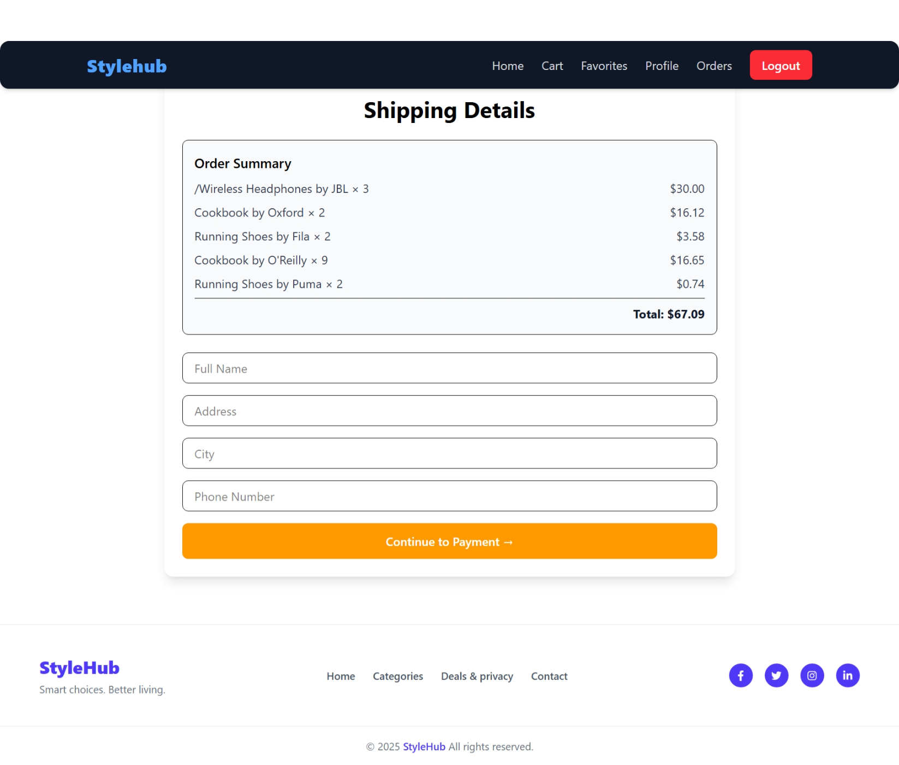

# 🛒 **E-Commerce Website**

A modern **responsive e-commerce frontend** built with **React**, **Tailwind CSS**, and **Vite**.  
This project includes product listing, cart management, favorites, a dummy payment flow, EmailJS contact form, AI-driven UI components, and a clean responsive design.

---

## 🔗 **Live Demo**

👉 **[Click Here to View the Live App](https://e-commerce-49ma.vercel.app/)**

---

## 📸 **Screenshots**

> *(Add your images into a `screenshots/` folder for them to display)*





---

## 🚀 **Features**

### **Core Features**
- 🛍️ **Product Listing** – All products with images, prices, and descriptions.  
- 🛒 **Shopping Cart** – Add/remove items, update quantities, persistent using localStorage.  
- ❤️ **Favorites / Wishlist** – Save favorite products.  
- ✉️ **Contact Form** – Send emails using EmailJS (no backend required).  
- 💳 **Payment (Demo Only)** – Address + card form UI for checkout simulation.  
- 🔍 **Search & Filter** – Search by keyword or category.  
- 🤖 **AI Visibility Component** – Highlights AI-based product suggestions.  
- 📱 **Responsive UI** – Optimized for mobile, tablet, and desktop.  
- 🎨 **Modern Icons** – Using Lucide React Icons.  
- 📦 **Order History** – Simulated progress (Pending → Delivered).

---

## 🛠 **Tech Stack**

- **Frontend:** React + Vite  
- **Styling:** Tailwind CSS  
- **State Management:** React Context API + useState  
- **Email Service:** EmailJS  
- **Icons:** Lucide React  
- **Hosting:** Netlify / Vercel  
- **Data:** Static JSON (mock backend)

---

## 💻 **Installation & Setup**

### **1. Clone the repository**
```bash
git clone https://github.com/amanuel1221/e-commerce.git
cd e-commerce
2. Install dependencies
bash
Copy code
npm install
3. Add environment variables (EmailJS)
Create a .env file:

ini
Copy code
VITE_EMAILJS_SERVICE_ID=xxxx
VITE_EMAILJS_TEMPLATE_ID=xxxx
VITE_EMAILJS_PUBLIC_KEY=xxxx
4. Start development server
bash
Copy code
npm run dev
5. Open the app
👉 http://localhost:5173

📂 Project Structure
css
Copy code
e-commerce/
├─ public/
├─ src/
│  ├─ components/
│  │   ├─ Header.jsx
│  │   ├─ Footer.jsx
│  │   ├─ ProductCard.jsx
│  │   ├─ CartItem.jsx
│  │   ├─ FavoriteItem.jsx
│  │   ├─ ContactForm.jsx
│  │   ├─ PaymentForm.jsx
│  │   └─ AIVisibility.jsx
│  ├─ pages/
│  │   ├─ Home.jsx
│  │   ├─ Product.jsx
│  │   ├─ Cart.jsx
│  │   ├─ Favorites.jsx
│  │   ├─ Contact.jsx
│  │   └─ Payment.jsx
│  ├─ context/
│  ├─ data/
│  ├─ services/
│  ├─ App.jsx
│  └─ main.jsx
├─ package.json
├─ tailwind.config.js
├─ vite.config.js
└─ README.md
⚡ Usage
Browse products and add them to Cart or Favorites

Manage items from Cart or Favorites

Submit the Contact Form using EmailJS

Test the demo payment UI

View AI suggested items

🧠 EmailJS Integration
Sends emails directly from frontend

No backend required

Uses Service ID, Template ID & Public Key

Safe and beginner friendly

Perfect for portfolio projects

💳 Payment Integration (Demo Only)
No real payment processing

Address & payment form included

Demonstrates real e-commerce checkout flow

Helps practice UI + form handling

🤖 AI Visibility Component
Highlights recommended products

Uses simulated AI logic

Reusable & scalable

Can be replaced with real AI/ML later

📚 What I Learned
1. Component Architecture
Structuring reusable components

Passing props the right way

Managing shared state efficiently

2. EmailJS
Setup and environment variables

Creating templates

Sending emails via frontend

Fixing silent/failed submissions

3. UI Libraries
Tailwind components

Lucide icons

Smooth animations with Framer Motion

Building clean & consistent UI

4. Cart & Payment Logic
Add / remove / update items

Calculate totals & quantities

Manage state with hooks

Build multi-step checkout UI

5. Deployment
Fixing Vercel build errors

Handling environment variables

Managing production behavior

🧩 Challenges I Faced
1. Component Connection Issues
State not updating

Props not passed correctly
✔️ Solved by lifting state + reorganizing components

2. EmailJS Fails
Wrong IDs

Missing keys
✔️ Solved using .env and checking dashboard

3. UI Component Errors
Incorrect imports

Library setup issues
✔️ Solved through documentation reading

4. Cart & Payment Bugs
Totals not updating

UI breaks on navigation
✔️ Fixed through debugging and cleanup

5. Deployment Errors
Case-sensitive filenames

Missing dependencies
✔️ Solved using Vercel build logs

🔧 Future Improvements
Real backend (Node.js / Django)

Authentication (Login/Register)

Real payments (Stripe/PayPal)

Admin dashboard for managing products

AI-powered recommendations

Persistent orders & favorites in a database

🎯 About the Developer
Hi! I'm Amanuel Amare, a passionate Frontend Developer aiming to become a Full-Stack Engineer.
I enjoy building modern web apps with clean design, scalable architecture, and smooth user experience.

My focus areas include:

Clean UI/UX

Reusable components

Scalable code

Problem solving

Continuous learning

This project helped me improve React skills, state management, complex UI architecture, and real deployment workflows.

🛡️ Tech & Tools Badges
<div align="center">           </div>
🤝 Contributing
Fork the repo

Create new branch

bash
Copy code
git checkout -b feature/your-feature
Commit changes

bash
Copy code
git commit -m "Add your feature"
Push branch

bash
Copy code
git push origin feature/your-feature
Open a pull request

📄 License
This project is licensed under the MIT License.

🌟 Acknowledgements
React

Tailwind CSS

Vite

EmailJS

Lucide React Icons

